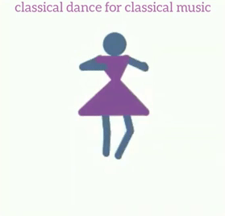
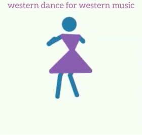
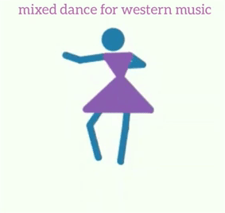

## :dancers: Music2Dance :dancer:
#### Generating Dance steps for given music (CNN + LSTM + MDN)

### Execution Steps:

    1. Installing
        * sudo pip3 install torch torchvision tensorboardX tensorflow numpy scipy imageio opencv-python
   
    2. Creating dataset from videos (Preprocessing videos)
        * python PoseNet/converter/tfjs2python.py
        * python index2_video_shot_processing.py
        * python index3_create_Only_in_out_dataset.py

    3. Training
        * python index4_train_mdn_simple_rnn_bnc.py

    4. Testing (works directly as pretrained weights included in repo)
        * run jupyter notebook in root directory
        * open index5_test_trained_model_simplernn_for_bnc.ipynb and run all cells
        * use some software(may be windows 10 photos app) to combine generated video and input audio

### Results:

| Classical | Western | Mixed |
|:---:|:---:|:---:|
|[](https://www.youtube.com/watch?v=Db79bIJvxdw) | [](https://www.youtube.com/watch?v=qbWkt3RPPOw) | [](https://www.youtube.com/watch?v=FqOioNX1FAI)


### Directory Structure:
```
Music2Dance(project root)
|
│   index2_video_shot_processing.py            - Process mp4 video files present in data directory
│   index3_create_Only_in_out_dataset.py       - Creating input/output bundles for training the model
│   index4_train_mdn_simple_rnn.py             - Process and train with training data
│   index4_train_mdn_simple_rnn_for_bnc.py     - Same as above but if training data has two types of dances (like western and classical)
│   index5_test_trained_model_simplernn.ipynb  - Testing trained model with random audio file
│   index5_test_trained_model_simplernn_for_bnc.ipynb
│   ReadMe.md
│
├───custom_utils                  - Utilities
│       datastft.py
│       mobilenet.py
│       video_shot_processing_utils.py
│
├───data
│   ├───test_audio
│   |       test_audio.wav
|   ├───audio_wav_indexed
|   |       audio (1).wav
|   └───video_wav_indexed
|           video (1).mp4
│
├───Object_detection              - Object Detection model to detect human bounding box before finding the pose 
│   │   mscoco_label_map.pbtxt
│   │   string_int_label_map.proto
│   │   visualization_utils.py
│   │
│   └───ssd_mobilenet_v1_coco_2018_01_28
│       │   checkpoint
│       │   frozen_inference_graph.pb
│       │   model.ckpt.data-00000-of-00001
│       │   model.ckpt.index
│       │   model.ckpt.meta
│       │   pipeline.config
│       │
│       └───saved_model
│           │   saved_model.pb
│           │
│           └───variables
├───output
│   ├───motiondance_simplernn     - Saved weights
│   │   └───checkpoints
│   │           epoch_{num}.pth.tar
│   │
│   ├───motiondance_simplernn_bnc
│   │   └───checkpoints
│   │           epoch_bnc_{num}.pth.tar
│   │
│   ├───Result                    - Test result video files are saved here
│   ├───Result_Audio
│   └───Result_Video
└───PoseNet
    └───converter
        │   config.yaml
        │   manifest.json
        │   tfjs2python.py        - Converting TensorflowJs model to python tensorflow understandable model
        │   wget.py
        │
        └───checkpoints
                checkpoint
                model.ckpt.data-00000-of-00001
                model.ckpt.index
                model.ckpt.meta        
```

### References:

* https://github.com/Fhrozen/motion_dance
* https://github.com/infocom-tpo/PoseNet-CoreML
* https://github.com/tensorflow/models/tree/master/research/object_detection
* https://github.com/axelbrando/Mixture-Density-Networks-for-distribution-and-uncertainty-estimation 

---
<p align="center">
  Copyright © 2018, Ajay Sreeram
</p>
